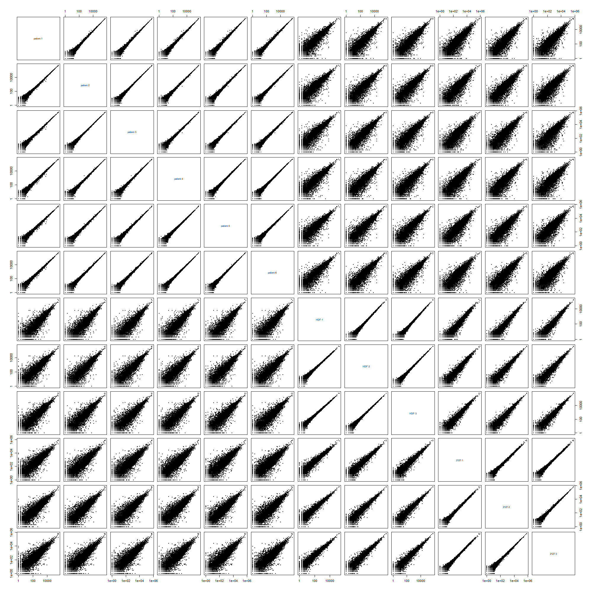
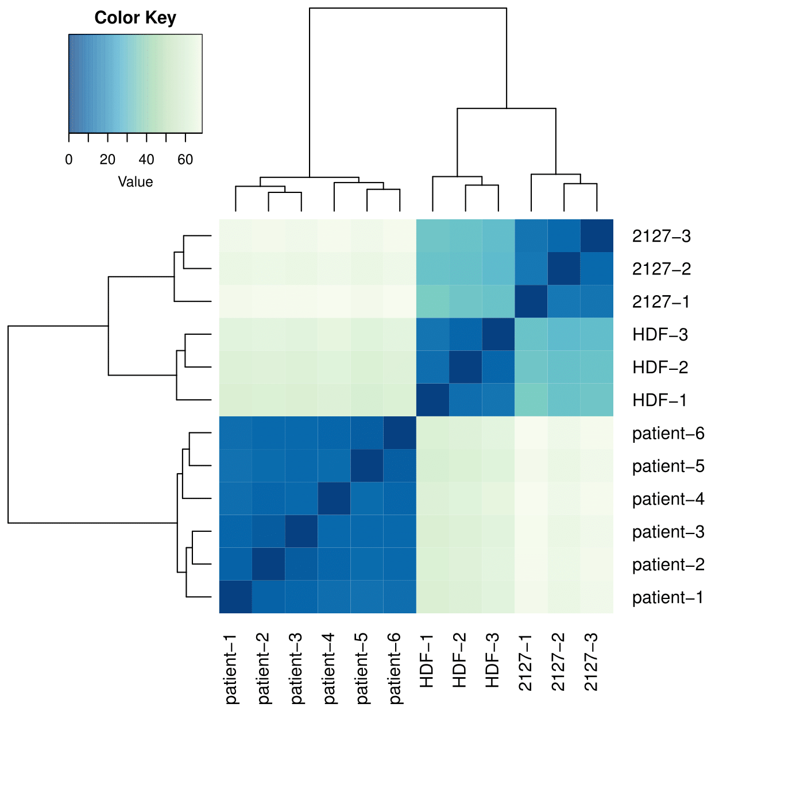
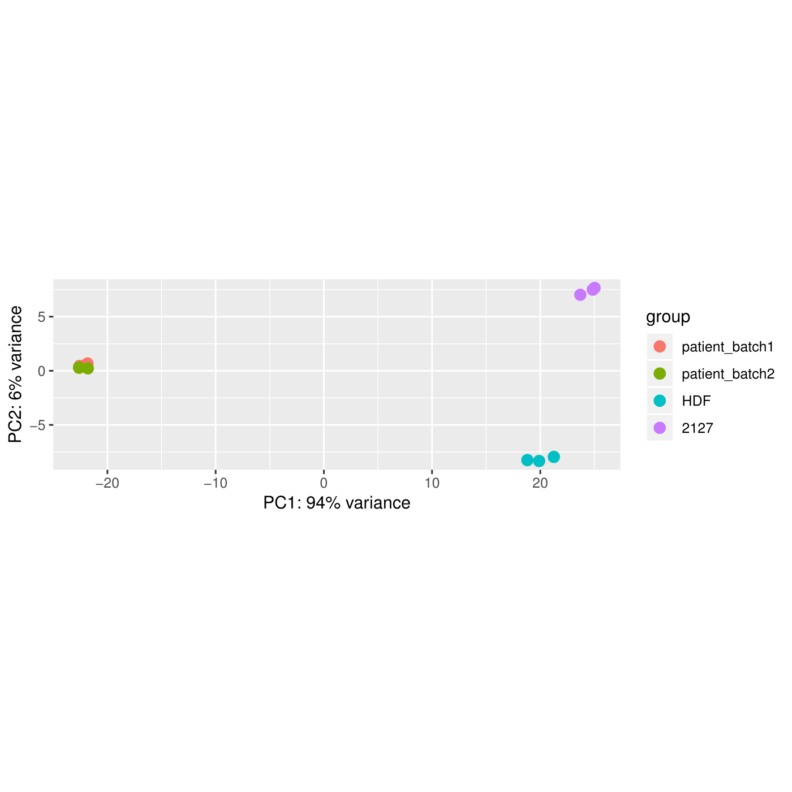
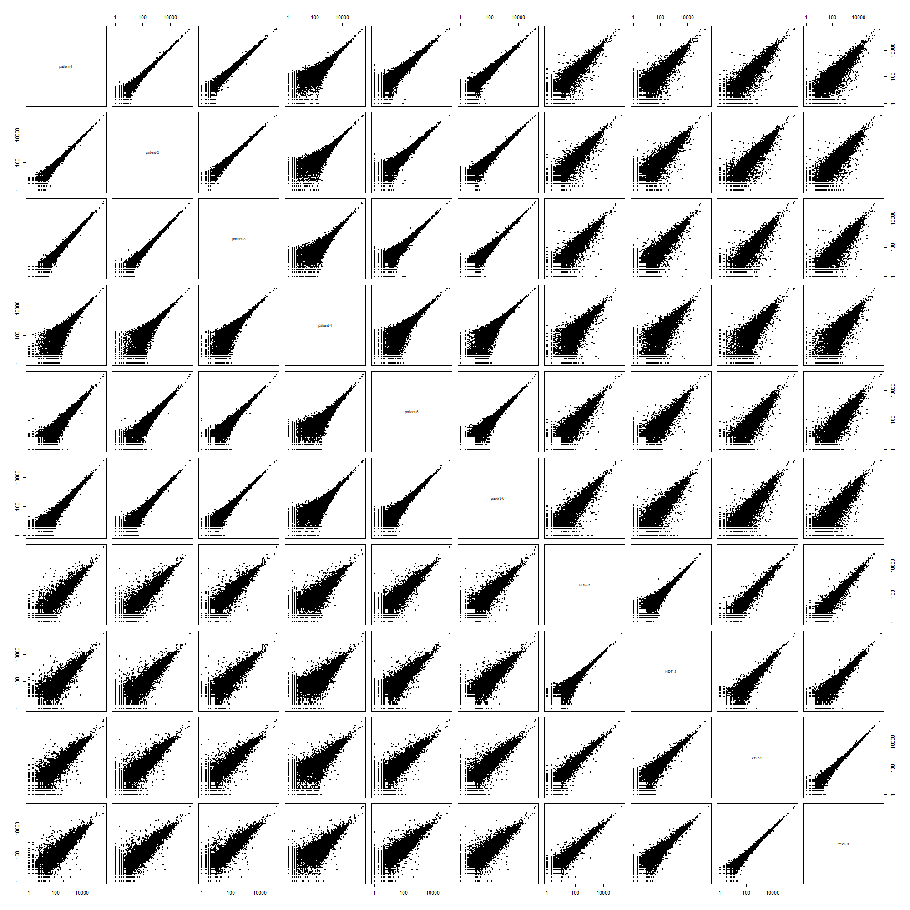

## Data Analysis for the O'Connell et al. (2019) PLOS Genetics

[Mammalian Hbs1L deficiency causes congenital anomalies and developmental delay associated with Pelota depletion and 80S monosome accumulation](https://doi.org/10.1371/journal.pgen.1007917)

**Prerequisites:**  
Cutadapt 1.18  
TopHat 2.1.1  
Bowtie 2.2.7  
featureCounts 1.6  
blast 2.7.1+  
Raw and processed data can be found in the NCBI GEO repository [GSE123564](https://www.ncbi.nlm.nih.gov/geo/query/acc.cgi?acc=GSE123564)

### Preparing genome annotation and index files
Human genomic sequences and annotation files (GRCh38.p12) were downloaded from the [NCBI repository](http://ftp.ncbi.nih.gov/genomes/H_sapiens/).  

| files             | MD5 check sum (unzipped)         | Description                                               |
| ----------------- |:--------------------------------:| ----------------------------------------------------------|
| GRCh38.p12.fa     | a4cac7d7ac4dd31ac68b384b10cf444d | RNA in fasta format, coding + noncoding                   |
| GRCh38.p12.fna    | 860290186a4ee3e95cd48dc528a45363 | Genome sequence, chromosomes and extrachromosomal contigs |
| GRCh38.p12.gbk    | 3c35b07e638485984479d50dd5cfebca | RNA in gene bank format, coding + noncoding               |
| GRCh38.p12.gff    | 56394751c00a5bdfb74152a7ed146855 | Genome annotation                                         | 

**Customizing genome annotation**  
Extrachromosomal contigs and annotations were omitted. 'Gnomon' (Predicted) records from gff file were also omitted and only 'RefSeq' (manually curated) left. Perl and R scripts are included in the GitHub repository.   
```bash
Discard_extrachromosomal_contigs.pl GRCh38.p12.fna >GRCh38.p12.custom.fna
Discard_extrachromosomal_annotation.pl GRCh38.p12.gff >GRCh38.p12.custom.gff
Discard_gnomon_annotation.pl >GRCh38.p12.Refseq.gff	# automatically takes GRCh38.p12.custom.gff as an input
```
Remove non-coding RNA genes, leave only coding genes with their mRNA, transcript, exon, and CDS children. Fix the gff annotation from previous script by matching gene coordinates with the childern coordinates (occured due to removal of Gnomon features).
```bash
Discard_noncoding_annotation.R
```
Generate BEDplus file with exon and CDS boundaries
```bash
gff_to_bed.pl GRCh38.p12.Refseq.coding.gff #outputs annotation.bed, annotation.lkp and logfile.txt. Rename annotation.bed to GRCh38.p12.Refseq.coding.bed
```


**Preparing non-redundant transcript sequences**  
Parse GRCh38.p12.gbk end extract the longest transcript for each gene.   
```bash
mRNA_extractor.pl GRCh38.p12.gbk	#generates temp3 file as output
```
Fill up their UTRs to 100 nt based on the genomic coordinates (if they are shorter). Takes temp3 file from previous step as input. Make sure GRCh38.p12.fna genome reference is present in the same folder.
```bash
mRNA_genome_filler.pl	#generates mRNA_100.fasta containing 19423 transcripts
```
To generate a non-redundant subset of transcripts, run blast all vs all, then process with a custom script  
```bash
makeblastdb -in mRNA_100.fasta -dbtype nucl #building an index
blastn -outfmt 6 -evalue 0.001 -db mRNA_100.fasta -query mRNA_100.fasta -out blast_result.txt
BLASTNprocessor.pl blast_result.txt	#generates mRNA_100uniq.fasta containing 16936 transcripts
```

**Building necessary index files**  
```bash
bowtie2-build ./Human_indices/GRCh38.p12.custom.fna ./Human_indices/NCBI_genome # indexing human genome for bowtie2 and Tophat
bowtie-build Human_rmtRNA.fa ./Human_indices/Human_rmtRNA
bowtie-build mRNA_100uniq.fa ./Human_indices/mRNA_100uniq
tophat -G GRCh38.p12.Refseq.coding.gff --transcriptome-index ./tophat-2.1.1/Human_indices/Refseq_coding ./bowtie2-2.2.7/Human_indices/NCBI_genome #Indexing human transcriptome for TopHat
```
 ### Illumina sequencing reads mapping
 **mRNA-seq** 
```bash
cutadapt -j 10 --overlap 5 -m 50 -a AGATCGGAAGAGCACACGTCTGAACTCCAGTCAC -o trimmed.fastq input.fastq #adapter trimming
bowtie -p 36 --un filtered.fastq bowtie-1.2.1.1/Human_indices/Human_rmtRNA trimmed.fastq >/dev/null #filtering out ribosomal, mitochondrial, tRNA and PhiX reads
#mapping for gene expression estimate
tophat -p 50 --library-type fr-firststrand --transcriptome-index ../tophat-2.1.1/Human_indices/Refseq_coding --no-novel-juncs -o ./mRNA/ ../bowtie2-2.2.7/Human_indices/NCBI_genome filtered.fastq #mapping to a transcriptome and a genome
featureCounts -g gene -s 2 accepted_hits.bam -a ./tophat-2.1.1/Human_indices/Refseq_coding.gff -o feature.counts #counting gene expression
#mapping for coverage depth plots
bowtie -p 36 -v 2 -m 1 –-nofw --max redundant.fastq /bowtie-1.2.1.1/mRNA_100uniq filtered.fastq >uniq.bwt
```
**Ribo-seq**  
```bash
cutadapt -j 10 -u 1 -m 23 -a AGATCGGAAGAGCACACGTCT --discard-untrimmed -o trimmed.fastq input.fastq
bowtie -p 36 --un filtered.fastq ./bowtie-1.2.1.1/Human_indexes/Human_rmtRNA trimmed.fastq >/dev/null
#mapping for gene expression estimate
tophat --library-type fr-secondstrand --transcriptome-index ./tophat-2.1.1/Human_indices/Refseq_coding --no-novel-juncs -o ./output_folder ./bowtie2-2.2.7/Human_indices/NCBI_genome filtered.fastq
featureCounts -g gene -s 1 accepted_hits.bam -a ./tophat-2.1.1/Human_indices/Refseq_coding.gff -o feature.counts
#mapping for coverage depth plots
bowtie -p 36 -v 2 -m 1 –-norc --max redundant.fastq /bowtie-1.2.1.1/mRNA_100uniq filtered.fastq >uniq.bwt
```

### Gene Expression Analysis
<details> <summary><b>mRNA-seq, Ribo-seq, and Translation efficiency</b></summary>
 
 Data analysis was performed in R. The code below is part of the *gene_expression_analysis.R* script
 ```R
library(magrittr)
library(DESeq2)
library(RColorBrewer)
library(gplots)
library(ggplot2)
library(rstudioapi)
setwd(dirname(getActiveDocumentContext()$path))


# Patient is a female and controls are males (based on the presense of genes located on X or Y chromosome respectively)
# Discard sex-linked genes to avoid outliers in gene expression calls
x.id <- read.table(file = list.files(path = "./mRNA_featureCounts", pattern = "*.counts", full.names = T)[1], skip=1, header=TRUE, row.names=1, stringsAsFactors = FALSE) %>% 
  .[grepl('NC_000024.', sapply(strsplit(.$Chr, ';', fixed = T), function(x) {return(x[1])})), ] %>%
  row.names(.) %>% .[grepl('Y',.)] %>% sub('Y', 'X',.) %>% c(., "RPS4X","RBMX")

keep <- read.table(file = list.files(path = "./mRNA_featureCounts", pattern = "*.counts", full.names = T)[1], skip=1, header=TRUE, row.names=1, stringsAsFactors = FALSE) %>% 
  .[!grepl('NC_000024.', sapply(strsplit(.$Chr, ';', fixed = T), function(x) {return(x[1])})), ] %>% .[-c(na.omit(match(x.id,row.names(.)))),] %>% row.names(.)

#------------------------------------------- Import & analyse mRNA-seq ----------------------------------------------------
sample_table <- read.table(file = "./mRNA_featureCounts/sample_table.txt", header = TRUE, sep = "\t", stringsAsFactors = FALSE)
countdata <- lapply(sample_table$file, function(x) {
  data <- read.table(file = paste0("./mRNA_featureCounts/", x), skip=1, header=TRUE, row.names=1, stringsAsFactors = FALSE)
  output <- data[,6] %>% setNames(., row.names(data))
}) %>% setNames(., sample_table$condition) %>% as.data.frame(., check.names = F) %>% .[row.names(.) %in% keep, ]
```
```R
# Optional matrix plot
pairs(countdata, log = "yx", pch = 20)
```
<details> <summary>mRNA-seq samples correlation plot</summary></details>  
<br>

```R
colData <- data.frame(   sample = colnames(countdata),
                         group = factor(c(rep("patient_batch1", 3), rep("patient_batch2", 3), rep("HDF",3), rep("2127",3)), levels = c("patient_batch1","patient_batch2","HDF","2127")),
                          stringsAsFactors = FALSE
                      )
dds <-DESeqDataSetFromMatrix(countData = countdata, colData = colData, design =~group )
dds <- dds[ rowMeans(counts(dds)) >= 10 , ] 
dds <- DESeq(dds)
 
     # plotting correlation heatmap and PCA between replicates and conditions
     rld <- rlogTransformation(dds, blind=TRUE)
     hmcol <- colorRampPalette(brewer.pal(9, "GnBu"))(100)
     distsRL <- dist(t(assay(rld)))
     mat <- as.matrix(distsRL)
     rownames(mat) <- colnames(mat) <- row.names(colData(dds))
     hc <- hclust(distsRL)
     pdf(file = "mRNAseq_heatmap.pdf")
     heatmap.2(mat, Rowv=as.dendrogram(hc),symm=TRUE,key=TRUE, density.info=c("none"), trace="none",col = rev(hmcol),margin=c(10, 10))
     dev.off()
     
     pdf(file = "mRNAseq_PCA.pdf")
     plotPCA(rld, intgroup=c("group"))
     dev.off()
```
<details> <summary>mRNA-seq samples heatmap and PCA</summary></details>  
<br>

```R 
    # #customized PCA plot, save to a file
    # pdf(file = "transcriptome_PCA_plot.pdf", width = 7, height = 4)
    # rv <- rowVars(assay(rld))
    # select <- order(rv, decreasing = TRUE)[seq_len(min(16000, length(rv)))] # DESeq2 by default used only 500 genes, I changed it to all genes
    # pca <- prcomp(t(assay(rld)[select, ]))
    # percentVar <- pca$sdev^2/sum(pca$sdev^2)
    # d <- data.frame(PC1 = pca$x[, 1], PC2 = pca$x[, 2],
    #                 intgroup.df =  as.data.frame(colData(rld)[, "condition", drop = FALSE]),
    #                 group = colData(rld)[["condition"]],
    #                 name = colnames(rld))
    # 
    # ggplot(data = d, aes_string(x = "PC1", y = "PC2", color = "group")) + 
    #   geom_point(size = 6) + 
    #   xlab(paste0("PC1: ", round(percentVar[1] * 100), "% variance")) +
    #   ylab(paste0("PC2: ", round(percentVar[2] * 100), "% variance")) +
    #   coord_fixed() +
    #   theme_bw() +
    #   theme(panel.grid = element_blank(), panel.border = element_rect(linetype = "solid", fill = NA, size = 2)) +
    #   theme(axis.ticks.length = unit(2, "mm"), axis.ticks = element_line(size = 1), axis.text = element_text(size = rel(1.25))) +
    #   theme(axis.title = element_text(size = rel(1.5)))+
    #   theme(legend.text = element_text(size = rel(1.2)), legend.title = element_blank())
    # dev.off()
    
# Because patient replicates are so similar (see commented section above) even between batches, they could be pooled together in the same category to simplify further analysis    
colData <- data.frame(sample = colnames(countdata),
                      group = factor(c(rep("patient", 6), rep("HDF",3), rep("2127",3)), levels = c("patient","HDF","2127")),
                      health = factor(c(rep("patient", 6), rep("healthy",6)), levels = c("patient","healthy")),
                      stringsAsFactors = FALSE
)    
dds <- DESeqDataSetFromMatrix(countData = countdata, colData = colData, design =~ group)
dds <- dds[ rowMeans(counts(dds)) >= 10 , ] 
dds <- DESeq(dds)    
    
result <- results(dds, contrast = c("group", "patient",  "HDF"), cooksCutoff = FALSE, independentFiltering = FALSE, pAdjustMethod="bonferroni")
result <- result[order(result$padj),]
summary(result)
write.csv(as.data.frame(result),file="patient_vs_HDF_mRNAseq.csv")

result <- results(dds, contrast = c("group", "patient",  "2127"), cooksCutoff = FALSE, independentFiltering = FALSE, pAdjustMethod="bonferroni")
result <- result[order(result$padj),]
summary(result)
write.csv(as.data.frame(result),file="patient_vs_2127_mRNAseq.csv")

# compare patient against both controls combined
dds <- DESeqDataSetFromMatrix(countData = countdata, colData = colData, design =~ health)
dds <- dds[ rowMeans(counts(dds)) >= 10 , ] 
dds <- DESeq(dds)  
result <- results(dds, contrast = c("health", "patient",  "healthy"), cooksCutoff = FALSE, independentFiltering = FALSE, pAdjustMethod="bonferroni")
result <- result[order(result$padj),]
summary(result)
write.csv(as.data.frame(result),file="patient_vs_healthy_mRNAseq.csv")


#------------------------------------------- Import & analyse Ribo-seq ----------------------------------------------------
sample_table <- read.table(file = "./ribo_featureCounts/sample_table.txt", header = TRUE, sep = "\t", stringsAsFactors = FALSE)
countdata <- lapply(sample_table$file, function(x) {
  data <- read.table(file = paste0("./ribo_featureCounts/", x), skip=1, header=TRUE, row.names=1, stringsAsFactors = FALSE)
  output <- data[,6] %>% setNames(., row.names(data))
}) %>% setNames(., sample_table$condition) %>% as.data.frame(., check.names = F) %>% .[row.names(.) %in% keep, ]
```
```R
# Optional matrix plot
# pairs(countdata, log = "yx", pch = 20)
```
<details><summary>Ribo-seq samples correlation plot</summary></details>  
<br>  

```R
# Sample patient-4 ("0128-01_p7_1") behaves as a technical outlier, therefore I droped it. All patient replicates are also pooled together
countdata <- countdata[c(1:3,5:10)]
      
colData <- data.frame( sample = colnames(countdata),
                       group = factor(c(rep("patient", 5), rep("HDF",2), rep("2127",2)), levels = c("patient","HDF","2127")),
                       health = factor(c(rep("patient", 5), rep("healthy",4)), levels = c("patient","healthy")),
                       stringsAsFactors = FALSE
)

dds <-DESeqDataSetFromMatrix(countData = countdata, colData = colData, design =~group )
dds <- dds[ rowMeans(counts(dds)) >= 10, ] 
dds <- DESeq(dds)

    # plotting correlation heatmap and PCA between replicates and conditions
    # rld <- rlogTransformation(dds, blind=TRUE)
    # hmcol <- colorRampPalette(brewer.pal(9, "GnBu"))(100)
    # distsRL <- dist(t(assay(rld)))
    # mat <- as.matrix(distsRL)
    # rownames(mat) <- colnames(mat) <- row.names(colData(dds))
    # hc <- hclust(distsRL)
    # pdf(file = "Riboseq_heatmap.pdf")
    # heatmap.2(mat, Rowv=as.dendrogram(hc),symm=TRUE,key=TRUE, density.info=c("none"), trace="none",col = rev(hmcol),margin=c(10, 10))
    # dev.off()
    # 
    # pdf(file = "Riboseq_PCA.pdf")
    # plotPCA(rld, intgroup=c("group"))
    # dev.off()

result <- results(dds, contrast = c("group", "patient",  "HDF"), cooksCutoff = FALSE, independentFiltering = FALSE, pAdjustMethod="bonferroni")
result <- result[order(result$padj),]
summary(result)
write.csv(as.data.frame(result),file="patient_vs_HDF_Riboseq.csv")

result <- results(dds, contrast = c("group", "patient",  "2127"), cooksCutoff = FALSE, independentFiltering = FALSE, pAdjustMethod="bonferroni")
result <- result[order(result$padj),]
summary(result)
write.csv(as.data.frame(result),file="patient_vs_2127_Riboseq.csv")


dds <-DESeqDataSetFromMatrix(countData = countdata, colData = colData, design =~health )
dds <- dds[ rowMeans(counts(dds)) >= 10, ] 
dds <- DESeq(dds)
result <- result[order(result$padj),]
summary(result)
write.csv(as.data.frame(result),file="patient_vs_healthy_Riboseq.csv")


#------------------------------------------- Translation Efficiency ----------------------------------------------------
library(limma)
library(preprocessCore)

# Many histone transcripts do not have a polyA tail, therefore will not be captured by oligo-dT library prep
# Discard these genes prior to analysis of TE
histones.id <- read.table(file = list.files(path = "./mRNA_featureCounts", pattern = "*.counts", full.names = T)[1], skip=1, header=TRUE, row.names=1, stringsAsFactors = FALSE) %>% row.names(.) %>% .[grepl('HIST1|HIST2|HIST3|HIST4',.)]

ribo_sample_table <- read.table(file = "./ribo_featureCounts/sample_table.txt", header = TRUE, sep = "\t", stringsAsFactors = FALSE)
mRNA_sample_table <- read.table(file = "./mRNA_featureCounts/sample_table.txt", header = TRUE, sep = "\t", stringsAsFactors = FALSE)
ribo.countdata <- lapply(ribo_sample_table$file, function(x) {
  data <- read.table(file = paste0("./ribo_featureCounts/", x), skip=1, header=TRUE, row.names=1, stringsAsFactors = FALSE)
  output <- data[,6] %>% setNames(., row.names(data))
}) %>% setNames(., ribo_sample_table$condition) %>% as.data.frame(., check.names = F) %>% .[row.names(.) %in% keep, ] %>% .[!(row.names(.) %in% histones.id), ] %>% .[c(1:3,5:10)] %>% .[rowMeans(.) > 10,] %>% .[apply(., 1, function(x) {all(x !=0)}), ]

mRNA.countdata <- lapply(mRNA_sample_table$file, function(x) {
  data <- read.table(file = paste0("./mRNA_featureCounts/", x), skip=1, header=TRUE, row.names=1, stringsAsFactors = FALSE)
  output <- data[,6] %>% setNames(., row.names(data))
}) %>% setNames(., mRNA_sample_table$condition) %>% as.data.frame(., check.names = F) %>% .[row.names(.) %in% keep, ] %>% .[!(row.names(.) %in% histones.id), ]  %>% .[rowMeans(.) > 10,] %>% .[, colnames(ribo.countdata)] %>% .[apply(., 1, function(x) {all(x !=0)}), ]

shared.genes <- intersect(row.names(mRNA.countdata), row.names(ribo.countdata))
ribo.countdata <- ribo.countdata[row.names(ribo.countdata) %in% shared.genes, ] %>% log2() 
mRNA.countdata <- mRNA.countdata[row.names(mRNA.countdata) %in% shared.genes, ] %>% log2() 

# Normalize by medians and proceed with limma
ribo.countdata[,1:ncol(ribo.countdata)]  <- lapply(ribo.countdata,  function (x) { x - median(x)  })
mRNA.countdata[,1:ncol(mRNA.countdata)]  <- lapply(mRNA.countdata,  function (x) { x - median(x)  })
TE <- ribo.countdata - mRNA.countdata
design <- cbind("patient"=c(1,1,1,1,1,0,0,0,0), "HDF"=c(0,0,0,0,0,1,1,0,0), "f2127"=c(0,0,0,0,0,0,0,1,1))
row.names(design) <- colnames(TE)
fit <- lmFit(TE, design)
cont <- makeContrasts(patient - HDF, patient - f2127, patient - (HDF+f2127)/2, levels = design)
fit.cont <- contrasts.fit(fit, cont)
fit.cont <- eBayes(fit.cont)

patient_vs_HDF     <- as.data.frame(topTable(fit.cont, coef = 1, number=Inf, adjust.method = "BH"))[,1:5]; patient_vs_HDF$gene_name <- row.names(patient_vs_HDF); rownames(patient_vs_HDF) <- NULL; names(patient_vs_HDF)[1] <- 'Log2(FC)'; patient_vs_HDF <- patient_vs_HDF[,c(6,1:5)]
patient_vs_2127    <- as.data.frame(topTable(fit.cont, coef = 2, number=Inf, adjust.method = "BH"))[,1:5]; patient_vs_2127$gene_name <- row.names(patient_vs_2127); rownames(patient_vs_2127) <- NULL; names(patient_vs_2127)[1] <- 'Log2(FC)'; patient_vs_2127 <- patient_vs_2127[,c(6,1:5)]
patient_vs_healthy <- as.data.frame(topTable(fit.cont, coef = 3, number=Inf, adjust.method = "BH"))[,1:5]; patient_vs_healthy$gene_name <- row.names(patient_vs_healthy); rownames(patient_vs_healthy) <- NULL; names(patient_vs_healthy)[1] <- 'Log2(FC)'; patient_vs_healthy <- patient_vs_healthy[,c(6,1:5)]
 
write.csv(patient_vs_HDF, file="patient_vs_HDF_TE.csv", row.names=FALSE)
write.csv(patient_vs_2127, file="patient_vs_2127_TE.csv", row.names=FALSE)
write.csv(patient_vs_healthy, file="patient_vs_healthy_TE.csv", row.names=FALSE)

# Normalize by quantiles and proceed with limma
TE.quant <- as.matrix(TE)
TE.quant <- as.data.frame(normalize.quantiles(TE.quant, copy=F), check.names=F)
fit.quant <- lmFit(TE.quant, design)
fit.quant.cont <- contrasts.fit(fit.quant, cont)
fit.quant.cont <- eBayes(fit.quant.cont)
patient_vs_HDF.quant     <- as.data.frame(topTable(fit.quant.cont, coef = 1, number=Inf, adjust.method = "BH"))[,1:5]; patient_vs_HDF.quant$gene_name <- row.names(patient_vs_HDF.quant); rownames(patient_vs_HDF.quant) <- NULL; names(patient_vs_HDF.quant)[1] <- 'Log2(FC)'; patient_vs_HDF.quant <- patient_vs_HDF.quant[,c(6,1:5)]
patient_vs_2127.quant    <- as.data.frame(topTable(fit.quant.cont, coef = 2, number=Inf, adjust.method = "BH"))[,1:5]; patient_vs_2127.quant$gene_name <- row.names(patient_vs_2127.quant); rownames(patient_vs_2127.quant) <- NULL; names(patient_vs_2127.quant)[1] <- 'Log2(FC)'; patient_vs_2127.quant <- patient_vs_2127.quant[,c(6,1:5)]
patient_vs_healthy.quant <- as.data.frame(topTable(fit.quant.cont, coef = 3, number=Inf, adjust.method = "BH"))[,1:5]; patient_vs_healthy.quant$gene_name <- row.names(patient_vs_healthy.quant); rownames(patient_vs_healthy.quant) <- NULL; names(patient_vs_healthy.quant)[1] <- 'Log2(FC)'; patient_vs_healthy.quant <- patient_vs_healthy.quant[,c(6,1:5)]

write.csv(patient_vs_HDF.quant, file="patient_vs_HDF_TEquant.csv", row.names=FALSE)
write.csv(patient_vs_2127.quant, file="patient_vs_2127_TEquant.csv", row.names=FALSE)
write.csv(patient_vs_healthy.quant, file="patient_vs_healthy_TEquant.csv", row.names=FALSE)
 ```
   
   
</details>


### Metagene Coverage Profiles
Although this information can be obtained from Ribo-seq and mRNA-seq genomic alignment files, it is much easier to re-align raw reads to the *mRNA-100uniq.fasta* file prepared earlier because aligned reads will have transcript coordinates (discontnious) instead of genomic (broken down into exons).
```bash
Coverage.pl uniq.bwt #make sure mRNA_100uniq.fasta is in the same folder with the script or add full path inside the sript
Coverge.R #process coverage files, plot and explore
```
<details><summary><b>Ribosome occupancy plot </b></summary>
 
Green, red, and blue tracks are patient and two healthy controls corespondingly. Grey track is the mRNA coverage from one of healthy controls. Transcripts are aligned by start codon (left panel) or stop codon (right panel). 100 nt unto UTR are added on both sides.
 
 
</details>
