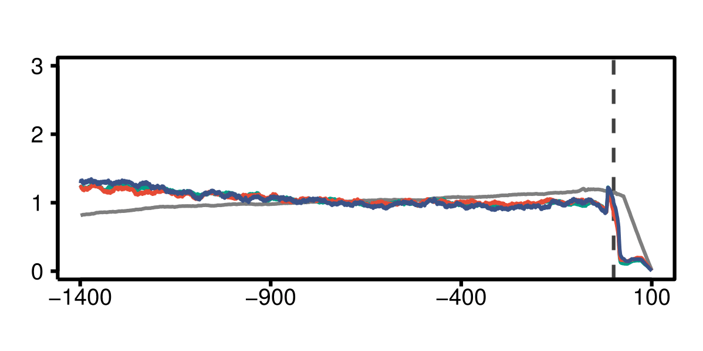

# OConnell_2018

## 

**Prerequisites:**  
Cutadapt 1.19  
TopHat 2.1.1  
Bowtie 2.2.7  
featureCounts 1.6  
blast 2.7.1+  
Index files and custom annotation can be found in the GEO [NCBI repository]()

### Preparing genome annotation and index files
Human genomic sequences and annotation files (GRCh38.p12) were downloaded from the [NCBI repository](ftp://ftp.ncbi.nih.gov/genomes/H_sapiens/).  

| files             | MD5 check sum (unzipped)         | Description                                               |
| ----------------- |:--------------------------------:| ----------------------------------------------------------|
| GRCh38.p12.fa     | a4cac7d7ac4dd31ac68b384b10cf444d | RNA in fasta format, coding + noncoding                   |
| GRCh38.p12.fna    | 860290186a4ee3e95cd48dc528a45363 | Genome sequence, chromosomes and extrachromosomal contigs |
| GRCh38.p12.gbk    | 3c35b07e638485984479d50dd5cfebca | RNA in gene bank format, coding + noncoding               |
| GRCh38.p12.gff    | 56394751c00a5bdfb74152a7ed146855 | Genome annotation                                         | 

**Customizing genome annotation**  
Extrachromosomal contigs and annotations were omitted. 'Gnomon' (Predicted) records from gff file were also omitted and only 'RefSeq' (manually curated) left. Perl and R scripts are included in the GitHub repository.   
```bash
Discard_extrachromosomal_contigs.pl GRCh38.p12.fna >GRCh38.p12.custom.fna
Discard_extrachromosomal_annotation.pl GRCh38.p12.gff >GRCh38.p12.custom.gff
Discard_gnomon_annotation.pl >GRCh38.p12.Refseq.gff	# automatically takes GRCh38.p12.custom.gff as an input
```
Remove non-coding RNA genes, leave only coding genes with their mRNA, transcript, exon, and CDS children. Fix the gff annotation from previous script by matching gene coordinates with the childern coordinates (occured due to removal of Gnomon features).
```bash
Discard_noncoding_annotation.R
```

**Preparing non-redundant transcript sequences**  
Parse GRCh38.p12.gbk end extract the longest transcript for each gene.   
```bash
mRNA_extractor.pl GRCh38.p12.gbk	#generates temp3 file as output
```
Fill up their UTRs to 100 nt based on the genomic coordinates (if they are shorter). Takes temp3 file from previous step as input. Make sure GRCh38.p12.fna genome reference is present in the same folder.
```bash
mRNA_genome_filter.pl	#generates mRNA_100.fasta containing 19423 transcripts
```
To generate a non-redundant subset of transcripts, run blast all vs all, then process with a custom script  
```bash
makeblastdb -in mRNA_100.fasta -dbtype nucl #building an index
blastn -outfmt 6 -evalue 0.001 -db mRNA_100.fasta -query mRNA_100.fasta -out blast.result.txt
BLASTNprocesor.pl blast_result.txt	#generates mRNA_100uniq.fasta containing 16936 transcripts
```

**Building necessary index files**  
```bash
bowtie2-build ./Human_indices/GRCh38.p12.custom.fna ./Human_indices/NCBI_genome # indexing human genome for bowtie2 and Tophat
tophat -G GRCh38.p12.Refseq.coding.gff --transcriptome-index ./tophat-2.1.1/Human_indices/Refseq_coding ./bowtie2-2.2.7/Human_indices/NCBI_genome #Indexing human transcriptome for TopHat
```
 ### Illumina sequencing reads mapping
 **mRNA-seq** 
```bash
cutadapt -j 10 --overlap 5 -m 50 -a AGATCGGAAGAGCACACGTCTGAACTCCAGTCAC -o trimmed.fastq input.fastq #adapter trimming
bowtie -p 36 --un filtered.fastq bowtie-1.2.1.1/Human_indices/Human_rmtRNA trimmed.fq >/dev/null #filtering out ribosomal, mitochondrial, tRNA and PhiX reads
#mapping for gene expression estimate
tophat -p 50 --library-type fr-firststrand --transcriptome-index ../tophat-2.1.1/Human_indices/Refseq_coding --no-novel-juncs -o ./mRNA/ ../bowtie2-2.2.7/Human_indices/NCBI_genome filtered.fastq #mapping to a transcriptome and a genome
featureCounts -g gene -s 2 accepted_hits.bam -a ./tophat-2.1.1/Human_indices/Refseq_coding.gff -o feature.counts #counting gene expression
#mapping for coverage depth plots
bowtie -p 36 -v 2 -m 1 –-nofw --max redundant.fastq /bowtie-1.2.2/mRNA_100uniq filtered.fastq >uniq.bwt
```
**Ribo-seq**  
```bash
cutadapt -j 10 -u 1 -m 23 -a AGATCGGAAGAGCACACGTCT --discard-untrimmed -o trimmed.fastq input.fastq
bowtie -p 36 --un filtered.fastq ./bowtie-1.2.1.1/Human_indexes/Human_rmtRNA trimmed.fastq >/dev/null
#mapping for gene expression estimate
tophat --library-type fr-secondstrand --transcriptome-index ./tophat-2.1.1/Human_indices/Refseq_coding --no-novel-juncs -o ./output_folder ./bowtie2-2.2.7/Human_indices/NCBI_genome filtered.fastq
featureCounts -g gene -s 1 accepted_hits.bam -a ./tophat-2.1.1/Human_indices/Refseq_coding.gff -o feature.counts
#mapping for coverage depth plots
```

### Gene Expression Analysis
<details> <summary><b>mRNA-seq</b></summary>
   
</details>
<details> <summary><b>Ribo-seq</b></summary>
  
</details>
<details> <summary><b>Translation efficiency</b></summary>
  
</details>


### Metagene Coverage Profiles
Although this information can be obtained from Ribo-seq and mRNA-seq genomic alignment files, it is much easier to re-align raw reads to the *mRNA-100uniq.fasta* file prepared earlier because aligned reads will have transcript coordinates (discontnious) instead of genomic (broken down into exons).
```bash
Coverage.pl uniq.bwt #make sure mRNA_100uniq.fasta is in the same folder with the script or add full path inside the sript
Coverge.R #process coverage files, plot and explore
```
 
